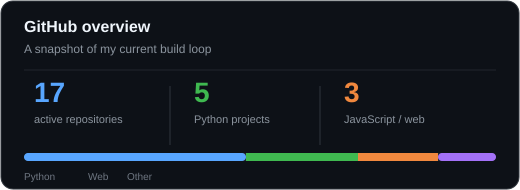
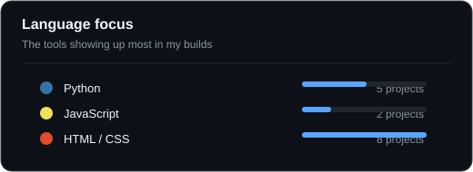

# Hi, I'm Suriya Prakash 👋

### Computer Science Student · Builder · Problem Solver

  
  
  

## About me

I’m a Computer Science student focused on building practical projects, strengthening problem-solving skills, and becoming a dependable software engineer. I enjoy taking ideas from a rough concept to a working prototype, especially when the project involves automation, machine learning, or a thoughtful user experience.

- Currently sharpening **data structures, algorithms, and full-stack development**
- Exploring **AI-assisted tools, developer automation, and scalable software design**
- Interested in collaborating on **useful open-source and student-led projects**
- I value **clear code, consistent learning, and shipping real things**

## What I work with

## Selected work

| Project | What it shows |
| --- | --- |
| [**Zyra**](https://github.com/SuriyaPrakash-sp/Zyra) | Recent JavaScript product work and rapid prototyping |
| [**AXON**](https://github.com/SuriyaPrakash-sp/AXON) | Python-based experimentation and systems thinking |
| [**NeuroTrace**](https://github.com/SuriyaPrakash-sp/NeuroTrace) | Interest in intelligent and data-driven applications |
| [**VibeCoding-bot**](https://github.com/SuriyaPrakash-sp/VibeCoding-bot) | Automation that keeps coding practice consistent |
| [**Sandisk-Cerebrum**](https://github.com/SuriyaPrakash-sp/Sandisk-Cerebrum) | Hackathon-oriented collaboration and execution |

> See more experiments and builds in my [repositories](https://github.com/SuriyaPrakash-sp?tab=repositories).

## GitHub activity

  
  

  

## Contribution trail

  

### Let’s build something useful.

<a href="https://github.com/SuriyaPrakash-sp?tab=repositories">Explore my work</a> · <a href="https://github.com/SuriyaPrakash-sp">Get in touch</a>

<!--
  Profile README maintained by Suriya Prakash.
  The contribution animation is generated by .github/workflows/snake.yml.
-->
