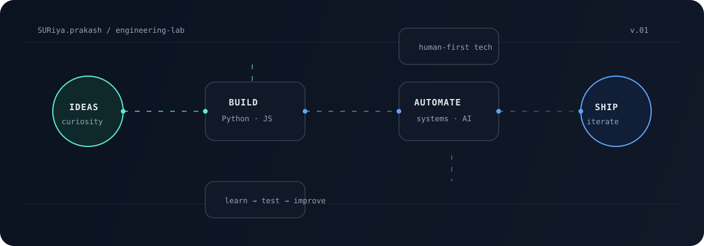

<div align="center">

# Suriya Prakash

**I turn curious questions into working software.**

[](https://github.com/SuriyaPrakash-sp)
[](https://github.com/SuriyaPrakash-sp?tab=repositories)

</div>



## The short version

I’m a Computer Science student who likes the part between **“what if?”** and **“it works.”** My projects are a running lab for learning how software behaves in the real world: with imperfect requirements, limited time, and people who actually need to use it.

Right now I’m investing in three things: **problem solving**, **reliable full-stack fundamentals**, and the practical side of **AI and automation**.

## What I’m building around

```text
             useful idea
                  │
       ┌──────────┼──────────┐
       ▼          ▼          ▼
   understand   prototype   simplify
       │          │          │
       └──────────┼──────────┘
                  ▼
             ship → learn → repeat
```

| Signal | In practice |
| --- | --- |
| **Build** | Small products, prototypes, and hackathon experiments that solve a defined problem. |
| **Think** | Data structures, algorithms, system behaviour, and the trade-offs behind implementation choices. |
| **Improve** | Refactoring rough ideas into clearer interfaces, better automation, and more useful workflows. |

## Projects with a pulse

### [`Zyra`](https://github.com/SuriyaPrakash-sp/Zyra)
A recent JavaScript build. This is where I’m practising product thinking: turning an idea into an interface that can be explored, tested, and improved.

### [`VibeCoding-bot`](https://github.com/SuriyaPrakash-sp/VibeCoding-bot)
A small reminder bot for LeetCode and Codeforces practice. A simple project with a useful lesson: consistency is easier when the system remembers for you.

### [`AXON`](https://github.com/SuriyaPrakash-sp/AXON) · [`NeuroTrace`](https://github.com/SuriyaPrakash-sp/NeuroTrace)
Python projects from my intelligent-systems track: experiments in modelling, data, and the questions that appear when software has to do more than follow a fixed script.

### [`Sandisk-Cerebrum`](https://github.com/SuriyaPrakash-sp/Sandisk-Cerebrum)
Hackathon work where collaboration, speed, and a clear problem statement matter as much as the code.

[**Browse all repositories →**](https://github.com/SuriyaPrakash-sp?tab=repositories)

## Current learning queue

- [ ] Become faster and more systematic at data structures and algorithms
- [ ] Build stronger backend and API fundamentals
- [ ] Learn to evaluate AI features instead of adding AI by default
- [ ] Contribute more consistently to open source
- [ ] Write project documentation that helps the next person run the code

## Tools I reach for

`Python` · `JavaScript` · `HTML/CSS` · `Git` · `GitHub` · `Machine Learning`

I care less about collecting tools and more about knowing **when not to use one**.

## A small note on this profile

The animated diagram above is custom-made for this profile. It represents my preferred loop: **ideas → build → automate → ship**. The animation is intentionally subtle; the work should remain the focus.

<div align="center">

**If you found something useful here, feel free to explore, open an issue, or say hello.**

[Explore the lab](https://github.com/SuriyaPrakash-sp?tab=repositories) · [Connect on GitHub](https://github.com/SuriyaPrakash-sp)

</div>
